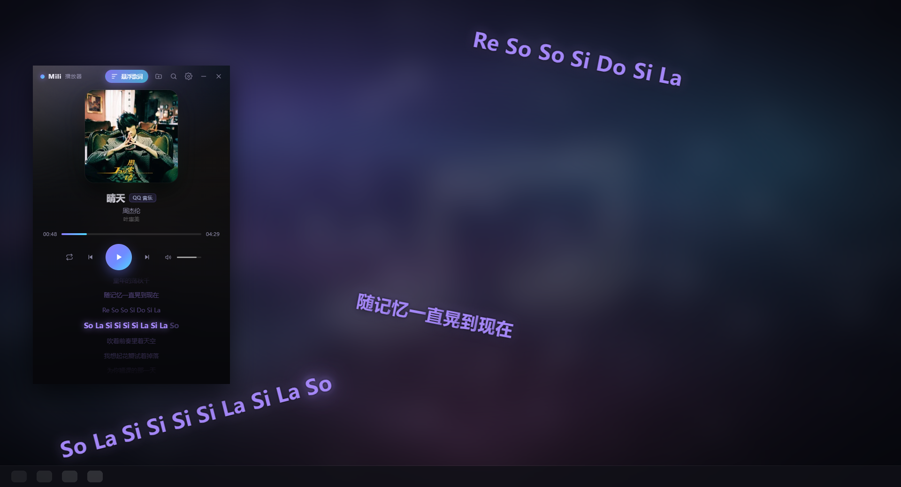
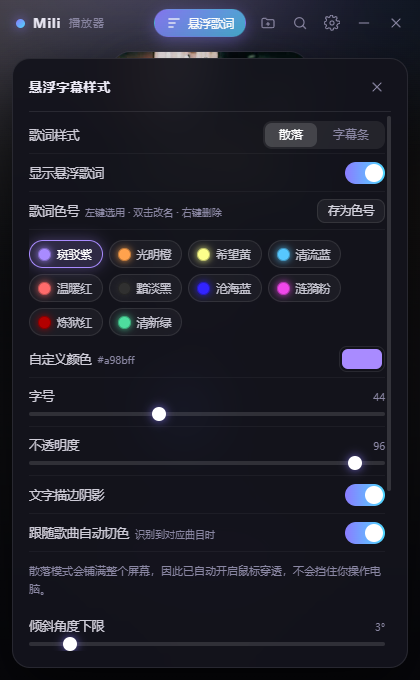

# Mili 播放器

以**悬浮字幕**为核心的音乐播放器：歌词以透明、无边框、置顶的字幕浮在桌面上，
逐字高亮、跟随播放进度滚动，配合主窗口做一个简洁的沉浸式听歌界面。



<p align="center">
  
  
</p>

---

## 当前进度：第一步 · UI 界面（已完成）

| 模块 | 状态 | 说明 |
| --- | --- | --- |
| 主窗口 UI | ✅ | 深色卡片式，封面 / 歌曲信息 / 进度条 / 播放控制 / 歌词列表 |
| 散落歌词（默认） | ✅ | 全屏随机落点、各自倾斜、跟着歌声逐字浮现、逐字微颤（Limbus Company 风格） |
| 底部字幕条 | ✅ | 透明窄窗 + 上一行/当前行/下一行，逐字高亮，可拖动 |
| 歌词解析引擎 | ✅ | 标准 LRC、增强 LRC（逐字）、QQ 音乐 QRC（解密后同构） |
| 歌词色号 | ✅ | 4 个 Mili 主题色预置 + 自定义取色 + 存为新色号，选择自动持久化 |
| 字幕样式面板 | ✅ | 模式切换、色号、字号 / 不透明度 / 倾角 / 同屏句数 / 停留时长 / 对齐 / 底衬 |
| 托盘 + 全局快捷键 | ✅ | 托盘菜单控制播放、切换歌词样式；`Ctrl + Alt + L` 锁定穿透 |
| 真实音频播放 | ✅ | 打开或拖入本地音频文件，用 `<audio>` 真实播放，进度来自音频时钟 |
| 接入 QQ 音乐 | ✅ | 搜索歌曲 + 取逐字 QRC 歌词（自定义 3DES 解密）+ 真实封面/时长 |
| 自动配歌词 | ✅ | 载入本地文件后读 ID3 标签，自动去 QQ 音乐匹配歌词 |
| 在线播放 | ✅ | 应用内登录 QQ 音乐后，点搜索结果直接在线播放 |

> 因为还没有接入音频，进度条、播放/暂停、上一首/下一首目前驱动的是内部计时器，
> 用来完整演示逐字高亮的联动效果；音量条属于界面占位。

---

## 怎么打开

### 方式一：双击启动脚本（推荐，已实测可用）

项目根目录下：

| 文件 | 说明 |
| --- | --- |
| `启动 Mili 播放器（无窗口）.vbs` | 不弹控制台窗口，日常用这个 |
| `启动 Mili 播放器.cmd` | 保留控制台，出问题时用它看日志 |

启动器会自动处理两个坑：清掉 `ELECTRON_RUN_AS_NODE`（否则 electron 会退化成
纯 Node 而报 `Cannot read properties of undefined (reading 'setPath')`），
以及沙箱起不来时自动降级到 `--no-sandbox` 重试一次（会打印一行提示，属于正常兜底）。

### 方式二：打包好的 exe

```bash
npm run package     # 打包 + 自动补上启动脚本
```

产物在 `dist\Mili播放器-win32-x64\`，整个文件夹可以复制到别处独立运行，
设置和登录态写在该文件夹的 `data\` 下。

**但请双击同目录下的 `启动 Mili 播放器.vbs`，而不是 `Mili播放器.exe`。**
原因见下。

### 方式三：命令行

```bash
npm install     # 安装依赖（Electron）
npm start       # 启动
npm run dev     # 带 DevTools 启动
npm test        # 跑回归测试（见下）
```

### 关于 Chromium 沙箱（重要）

这台机器上 Chromium 自己的沙箱起不来，直接启动会**瞬间崩溃**。实测结论
（`node scripts/probe-sandbox.js` 可复现）：

- 崩溃发生在**主进程脚本执行之前** —— 连第一行 `console.log` 都没机会跑，
  所以「在应用里判断并自愈」做不到，只能由命令行带上 `--no-sandbox`
- 加了 `--no-sandbox` 之后一切正常

因此：

- **开发模式**：`scripts/start.js` 会先按默认（带沙箱）跑一次，
  8 秒内异常退出就自动加 `--no-sandbox` 重试
- **打包版**：exe 自己没法补救，所以打包时会自动在旁边放一个
  `启动 Mili 播放器.vbs`，它替你加上这个参数

如果你哪天把环境修好了（比如换了机器、关掉了冲突的安全软件），
直接双击 `Mili播放器.exe` 即可恢复默认的沙箱隔离。

如果 `npm install` 之后 Electron 运行时没装好（网络原因或写不进系统缓存目录），执行：

```bash
npm run setup:electron
```

它会下载 Electron 压缩包、解压到 `node_modules/electron/dist` 并写好 `path.txt`。

> 启动器 `scripts/start.js` 会先清掉环境变量 `ELECTRON_RUN_AS_NODE`。
> 某些编辑器 / 宿主环境会设置它，导致 `electron.exe` 退化成纯 Node 运行并报
> `Cannot read properties of undefined (reading 'setPath')`。
>
> 在受限宿主（例如 DSH 沙箱终端）里，Chromium 自己的沙箱会因无法创建命名管道而
> 启动即崩溃（`FATAL:platform_channel.cc Check failed: 拒绝访问`）。
> 启动器检测到这类环境会自动补上 `--no-sandbox`；在普通终端里则保持默认沙箱。

---

## 界面与操作

### 主窗口

- 顶部：`悬浮歌词` 开关、字幕样式、最小化、退出
- 中部：封面、歌曲信息、进度条（可拖动定位）、播放控制
- 下部：歌词列表，当前行高亮并逐字点亮，**点击任意一行可跳转到该句**

| 快捷键 | 作用 |
| --- | --- |
| `空格` | 播放 / 暂停 |
| `←` / `→` | 后退 / 前进 5 秒 |

### 两种歌词样式

样式面板（标题栏齿轮）第一项就是切换：

#### 散落歌词（默认）

Limbus Company 终战那种效果：每句歌词在**屏幕内随机落点**、**各自倾斜一个角度**、
**跟着歌声逐字浮现**。唱完的句子停留一会儿后淡出，屏幕上同时保持若干句。

- 悬浮窗口在散落模式下**铺满整个屏幕**（透明 + 置顶），因此**强制鼠标穿透**，
  不会挡住你操作电脑；窗口也设置为不可聚焦，不会抢焦点。
- 落点按「倾斜后的外接矩形」计算并留出边距，所以**整块文字永远不出屏**；
  新句子还会优先挑选不与已有句子重叠的位置。
- **倾斜角度在「下限～上限」之间均匀随机**，正负方向也随机（面板里两个滑杆都能调）。
  每句生成时领到一个随机系数，改上下限时已有句子会**原地平滑地重新落到新区间**，
  而不是被重掷角度或挪动落点。
- **每个字都在微微颤抖**：周期 1.7–3.0 秒、相位随机，所以整句不会同步晃，
  呈现出游戏里那种「不稳」的神经质手感（面板里可关）。
- **通篇不使用白色**：正在唱的字也是主题色，只把外发光打得更烈。
- 可调：倾斜角度下限 / 上限（各 0–30°）、同屏句数（1–8）、每句停留时长（3–20 秒）、
  字号随机、微微颤抖。

#### 底部字幕条

一条透明窄窗，上一行 / 当前行（逐字高亮）/ 下一行，可以按住拖动到任意位置，
位置会被记住。

| 操作 | 说明 |
| --- | --- |
| 按住任意位置拖动 | 移动字幕（位置会自动记住，仅字幕条模式） |
| 右键 | 快捷菜单：打开主窗口 / 锁定 / 重置位置 / 隐藏 / 退出（仅字幕条模式） |
| `Ctrl + Alt + L` | 全局快捷键，锁定或解锁鼠标穿透（仅字幕条模式；散落模式恒为锁定） |

可调：字号、不透明度、窗口宽度、左右对齐、是否显示上一行 / 下一行、
暗色底衬（浅色壁纸下更清晰）、文字描边阴影。

### 歌词色号

样式面板里的「歌词色号」用来换歌词的主题色，同时作用于**散落歌词、字幕条、
主窗口歌词列表**三处，以及文字的外发光。

内置十个色号，都取自 Mili 的曲子：

| 色号 | 出处 | 色值 |
| --- | --- | --- |
| 斑驳紫 | Through Patches of Violet | `#a98bff` |
| 光明橙 | Hero | `#ffa24d` |
| 希望黄 | Fly, My Wings | `#fcfe8b` |
| 清流蓝 | TIAN TIAN | `#57c8ff` |
| 温暖红 | SAIKAI | `#ff6b6b` |
| 黯淡黑 | Gone Angels | `#303030` |
| 沧海蓝 | Compass | `#3224ff` |
| 涟漪粉 | What the Ripple Sees | `#f047ea` |
| 炼狱红 | In Hell We Live, Lament | `#b30000` |
| 清新绿 | — | `#4ede9f` |

**跟随歌曲自动切色（彩蛋）**：打开后，识别到 Mili 的曲子会自动换成它的主题色。
上表里带「出处」的九个色号都有对应规则，一共 9 条。

**只在艺术家确实是 Mili 时才生效** —— 否则一首第五和弦的《Hero》、或者随便什么
同名曲都会被染色。判定方式是按分隔符切开艺术家字段逐个比对，所以
`Mili`、`Mili / KIHOW`、`Mili / 塞壬唱片-MSR` 都算，而 `Emilio` 不算。

规则表在 `src/shared/theme-rules.js`，想加歌往 `RULES` 里加一行即可。

| 操作 | 说明 |
| --- | --- |
| 左键点色号胶囊 | 立即切换 |
| **双击已选中的色号胶囊** | **就地改名**（回车确认 / Esc 取消 / 失焦也算确认） |
| 右键点色号胶囊 | 删除该色号（内置色号不可删，但可以改名） |
| 自定义颜色 | 用系统取色器任选颜色，实时预览 |
| 存为色号 | 把当前颜色存成一个新胶囊（自动命名「自定义 N」），之后一键切换 |

所有色号与当前选择都存在 `data/settings.json` 里，重启后保持。
内置色号带一个稳定的 `key`，所以**改名之后升级也认得出**，不会重复塞一个原名的进来。

色号的合并逻辑（补新增 / 不重复 / 改名后不回流 / 排序 / 去重）在
`src/main/color-presets.js`，有独立的单测：`npm run test:presets`。

### 自己添加色号和彩蛋曲目

**内置的那 10 个色号可以直接在面板上改**（单击选用 / 双击改名 / 右键删除自定义的），
不用碰任何文件。

想**新增**色号或彩蛋规则，改数据目录下的**一个**文件就行：

```
data/color-theme.json
```

第一次运行会自动生成，自带说明文字。改完存盘，**重启播放器生效**。
打包版的目录在 `dist\Mili播放器-win32-x64\data\`。

**加色号 + 配一条彩蛋规则**：

```json
{
  "presets": [
    { "name": "海盐蓝", "color": "#7fd4ff", "song": "某首歌", "builtin": true }
  ],
  "rules": [
    { "label": "海阔天空", "preset": "海盐蓝", "match": "海阔天空|海闊天空" }
  ]
}
```

`presets` 里每一项：

- `name` 显示名；`color` 是 `#rrggbb`
- `song` 可留空，只用于悬停提示
- `builtin: true` 表示不允许右键删除（仍可双击改名）；不写就能右键删掉

`rules` 里每一项：

- `match` 是**正则字符串**（大小写不敏感），拿「标题 + 专辑」去匹配
- `preset` 写**色号的名字**。**只写这个就够了**，颜色会自动按名字取
- `color` 可选，只在 `preset` 名字查不到时兜底
- `miliOnly: true` 表示只在艺术家是 Mili 时生效；不写则不限艺术家
  （内置规则默认就是限 Mili 的，你自己加的默认不限）

出错不会崩：正则写错只是这条规则被跳过；`preset` 指向的色号不存在又没填 `color` 时，
会弹提示告诉你哪条规则有问题，而不是默默把歌词变成白色。

> 旧版本把色号和规则拆成 `presets.json` / `theme-rules.json` 两个文件，
> 现在合并成 `color-theme.json` 一个。旧文件仍然会被读取，并在控制台提示你迁移。

内置色号在 `src/main/color-presets.js`，内置规则在 `src/shared/theme-rules.js`
—— 如果你想让自己加的色号**随仓库一起发布**（而不是只在本地生效），
把它们加进这两个文件即可。加完记得跑 `npm run test:theme`，
它会校验「每条规则指向的色号名字都真实存在」，能抓出两个文件之间的笔误。

改动立即生效不需要重新打包。

---

## 目录结构

### 哪些要上传，哪些不要

仓库里只放**源码**。下面这些东西体积大、又能随时重建，或者干脆是隐私，
都被 `.gitignore` 排除了：

| 目录 | 传? | 是什么 | 怎么重建 |
| --- | --- | --- | --- |
| `data/` | ❌ | **设置、自定义色号、QQ 音乐登录 Cookie** | 运行程序自动生成 |
| `node_modules/` | ❌ | 依赖包（约 300 MB） | `npm install` |
| `.electron-cache/` | ❌ | Electron 运行时压缩包（约 260 MB） | `npm run setup:electron` |
| `.npm-cache/` | ❌ | npm 下载缓存 | 自动 |
| `dist/` | ❌ | 打包出来的 exe | `npm run package` |
| `shots/` | ❌ | 截图 | `npm run shot` |
| `testdata/` | ❌ | 测试音频 | `npm run testdata` |
| `.reference/` | ❌ | 第三方 QRC 解密参考实现（GPL-3.0，只用于对照） | `node scripts/fetch-qrc-reference.js` |
| `src/` `scripts/` `assets/` `docs/` | ✅ | 源码、脚本、素材、文档截图 | — |

> `data/` 里那个 `qqmusic-session.json` 是你的登录凭据。
> 提交前用 `git add --dry-run .` 扫一眼最稳妥。

### 目录说明

```
mili播放器/
├── package.json              # 依赖与 npm 脚本
├── README.md
├── 启动 Mili 播放器.cmd       # 双击启动（保留控制台，看日志用）
├── 启动 Mili 播放器（无窗口）.vbs
├── docs/                     # README 里引用的截图 + 上传 GitHub 的指南
├── assets/                   # 封面、图标、托盘图标（make-assets.py 生成，程序运行要用）
├── scripts/                  # 开发与测试脚本，都不是程序的一部分
│   ├── start.js              #   启动器（清 ELECTRON_RUN_AS_NODE、沙箱降级重试）
│   ├── install-electron.ps1  #   手动安装 Electron 运行时
│   ├── fetch-electron.js     #   下载 Electron 压缩包
│   ├── make-assets.py        #   生成封面 / 图标
│   ├── make-dist-launchers.js#   给打包产物补上启动脚本
│   ├── gen-qrc-des.py        #   把参考实现 AST 转译成 JS 版自定义 3DES
│   ├── verify-qrc-des.js     #   校验 3DES 移植与参考实现逐字节一致
│   ├── test-*.js             #   各类测试（见「测试」一节）
│   ├── probe-*.js            #   接口侦察脚本（排查 QQ 音乐 / 沙箱环境用）
│   └── screenshot.js         #   无头截图，用于验收 UI
└── src/
    ├── main/                 # 主进程
    │   ├── main.js           #   窗口管理、状态中枢、托盘、快捷键、IPC
    │   ├── qqmusic.js        #   QQ 音乐客户端（搜索 / 歌词 / 播放地址）
    │   ├── qqmusic-session.js#   登录窗口 + 登录态存取
    │   ├── qrc.js            #   QRC 解密：3DES + zlib + 剥掉 XML 外壳
    │   ├── qrc-des.js        #   自定义 3DES（gen-qrc-des.py 自动生成，勿手改）
    │   ├── audio-proxy.js    #   mili-audio:// 代理，媒体请求头可控
    │   ├── audio-meta.js     #   ID3v2 标签解析 + 文件名推断
    │   ├── color-presets.js  #   内置色号 + 与已保存色号的合并逻辑
    │   ├── defaults.js       #   默认设置
    │   └── preload-*.js      #   两个窗口的 contextBridge
    ├── shared/               # 两个窗口共用的纯逻辑（没有 Electron 依赖，可直接单测）
    │   ├── lyric-parser.js   #   歌词解析（LRC / 增强 LRC / QRC 逐字）
    │   ├── theme-rules.js    #   彩蛋识别规则 + 规则到颜色的解析
    │   ├── color-util.js     #   色号归一化 + 写入 CSS 变量
    │   └── demo-data.js      #   内置演示歌曲
    └── renderer/
        ├── player/           # 主窗口
        └── overlay/          # 悬浮歌词窗口
```

上传到 GitHub 的完整步骤见 [`docs/如何上传到 GitHub.md`](docs/如何上传到%20GitHub.md)。

---

## 架构要点

**状态中枢在主进程。** 主窗口负责播放时间轴，通过 `player:sync` 把
`{ position, playing }` 推给主进程；主进程再广播给悬浮歌词窗口。
悬浮歌词窗口拿到基准时间后用本地时钟插值，所以即使同步频率只有 400ms，
逐字高亮依然是 60fps 顺滑的。

**歌词数据结构统一。** `lyric-parser.js` 把三种歌词格式都归一成：

```js
{
  meta:  { ti, ar, al, by, offset },
  lines: [{ time, text, translation, words: [{ text, time, dur }] }]
}
```

没有逐字时间轴的普通 LRC，会按字符权重把整行时长分配给每个词，
所以「逐字高亮」对任何歌词都能生效。

**散落落点怎么保证不出屏。** 一块文字按中心点锚定、旋转 θ 之后，它实际占的
外接矩形是 `bw = |w·cosθ| + |h·sinθ|`、`bh = |w·sinθ| + |h·cosθ|`。
在这个尺寸下把中心点限制在 `[边距 + bw/2, 屏幕宽 - 边距 - bw/2]` 里随机取，
整块就永远在屏幕内。新句子会随机试若干个落点，优先选不与已有句子重叠的那个；
句子太长超过可用宽度时，会先按比例缩一档字号。

**播放进度用墙上时钟，不逐帧累加。** `position = anchorPos + (Date.now() - anchorWall)/1000`，
配合主窗口的 `backgroundThrottling: false`。这样主窗口被最小化 / 隐藏、
`requestAnimationFrame` 停摆时，进度和悬浮歌词都不会冻住。

**歌词指纹用哈希，不比引用。** IPC 每次都会把数组结构化克隆成新对象，
按引用比较会「永远判定为换了歌」。现在用覆盖每句时间与文本的 FNV-1a 哈希，
只有真的换歌才重建字幕；改设置时已有字幕原地不动（改字号只会为不出屏做极小夹回）。

---

## 回归测试

```bash
npm test
```

`scripts/test-regressions.js` 会拉起两个窗口真跑一遍，覆盖四个容易回退的点：

| 用例 | 断言 |
| --- | --- |
| A | 主窗口隐藏 6 秒后，播放进度仍推进 ≈6 秒 |
| B1 | 改不透明度（与排版无关）后，已有字幕落点逐句一致 |
| B2 | 改字号后仍是同样几句，且只是屏内夹回（位移 < 120px，而不是重掷几百像素） |
| D1 | 倾斜上下限压成同一个值时，所有句子收敛到该角度 |
| D2 | 倾斜区间 `[2°, 18°]` 内每句角度都在区间内、且互不相同（证明真的随机） |
| D3 | 改倾斜范围只重新倾斜，落点位移 < 120px |
| E1 | 双击已选中的色号胶囊会变出改名输入框 |
| E2 | 改名回车后写回设置，且输入框收起 |
| C | 真的换歌时字幕必须重新生成（防止「永远不刷新」的反向问题） |

最后一项是刻意加的反向用例：修「改设置别重建」时很容易矫枉过正成「永远不重建」。
倾斜部分也一样 —— D2 里那句「互不相同」就是为了防止「随机」退化成「固定角」。

### 其它自检

```bash
npm run testdata     # 生成测试音频（WAV + 带 ID3 标签的合成 MP3）
npm run test:audio   # 真实播放：载入 -> 出声 -> 自动配歌词 -> 推到悬浮窗
npm run test:online  # 在线播放：vkey -> 预检 -> 代理 -> 真的解码出声 -> 可拖进度
npm run test:qq      # QQ 音乐链路：搜索 -> 解密 QRC -> 解析并校验时间轴 -> 播放地址请求结构
npm run test:qrc     # 校验 JS 版 3DES 与 Python 参考实现逐字节一致
npm run test:login   # 登录窗口能打开并加载 y.qq.com
npm run test:presets # 色号合并逻辑（纯 Node，不需要 Electron）
npm run test:theme   # 彩蛋识别规则 + 规则到颜色的解析（会顺带跑一遍 data/ 下的真实配置）
```

`test:audio` 覆盖 7 项：文件载入并播放、文件名推断、自动匹配歌词、
进度取自真实音频时钟、歌词推到悬浮窗、同步带真实位置、暂停后进度停住。

`test:online` 覆盖 7 项（需要先登录）：读到登录态、取到 vkey、
主进程预检拿到真实音频、`<audio>` 接受代理地址、真的在解码、播放持续推进、
跳到 90 秒后仍能播（Range 转发正常）。它会自动跳过 VIP 曲目。

`test:login` 只能验证到「窗口打开并加载成功」这一步 ——
**真正的账号登录必须你自己在应用里点「登录 QQ 音乐」完成**，我不会去碰你的凭据。

---

## 下一步

- **跟随歌曲自动切主题色**：识别到 SAIKAI 就自动上温暖红、Hero 上光明橙。
- **在线歌单**：现在只能一首首点，可以接歌单 / 每日推荐。
- **FLAC / M4A 的标签**：目前只解 ID3v2（mp3 最常见），
  FLAC 的 Vorbis Comment 与 MP4 的 `ilst` 还没做，这两种会回退到文件名推断。

---

## 载入真实音频

点标题栏的文件夹按钮，或者**直接把音频文件拖进窗口**。支持 mp3 / flac / m4a / aac / wav / ogg / opus。
多选或连续拖入会排队，播放控制里的上一首 / 下一首可以在队列里切换。

播放用的是渲染进程里的 `<audio>`，所以进度、时长、音量都是真实的：

- `currentTime` 直接当播放进度，不再用虚拟时钟
- 时长以音频文件为准，歌词推算的时长只作兜底
- 音量条和静音按钮接到 `audio.volume` / `audio.muted`
- 单曲循环交给 `audio.loop`，列表循环和自动下一首由 `ended` 事件驱动

> 主窗口被隐藏时，`rAF` 会停摆，所以除了 rAF 还挂了 `timeupdate` 监听 ——
> 双保险保证悬浮字幕不会因为窗口不可见就冻住。

### 自动配歌词

载入文件后会自动：

1. **读 ID3v2 标签**拿标题 / 艺术家 / 专辑 / 内嵌封面（`src/main/audio-meta.js`，不引第三方库）
2. 没有标签就**从文件名推断**，例如 `01. 周杰伦 - 晴天.wav` → 艺术家「周杰伦」、标题「晴天」
3. 用「标题 + 艺术家」去 QQ 音乐搜索，按标题吻合度 + 艺术家吻合度打分，
   **只有分数够高才自动套用**，否则提示你手动搜索，避免张冠李戴
4. 本地文件没有封面时，借用匹配到的 QQ 音乐封面

匹配结果会用底部提示条告诉你（例如「已匹配歌词：晴天 — 周杰伦（逐字）」）。

> ID3 解析踩过的坑：一是文本帧必须按**帧长度**截断，否则会吞掉后面的帧；
> 二是大量中文标注工具写的是「编码 0(ISO-8859-1) + 实际 UTF-8」这种不规范组合，
> 所以解析器会在编码 0 时先按 UTF-8 试一遍，没有替换字符就采用。

### 在线播放

点搜索结果里的歌会**直接在线播放**（前提是已登录 QQ 音乐）。

搜索结果一行的两个动作是分开的：

| 点哪里 | 做什么 |
| --- | --- |
| 整行（封面/歌名那块） | **只载入歌词**，不碰正在播的音频 |
| 右侧的 ▶ 按钮 | **在线播放**（未登录时提示去登录） |

分开是刻意的：想只给现有音频换一版歌词时（比如配错了歌），不该被迫开始播放。

在线播放需要登录，这是 QQ 音乐的接口限制：未登录时取播放地址的 `vkey` 接口回的
`result=104003` 且 `purl` 为空，**连非 VIP 曲目也一样**（`scripts/probe-songurl.js` 可复现）。

登录方式**不是让你粘贴 Cookie** —— 凭据不该经过剪贴板和输入框：

1. 在搜索面板点「登录 QQ 音乐」
2. 应用会开一个**真实的 y.qq.com 登录窗口**，你在官方页面上正常登录（扫码或账号）
3. 我们轮询这个窗口的会话，一旦出现音乐密钥类 Cookie（`qm_keyst` / `qqmusic_key`）
   就认定登录成功，自动关闭窗口
4. Cookie 存到 `data/qqmusic-session.json`，并塞回默认会话 ——
   这样媒体请求会自动带上登录态，下次启动也不用重新登录

登录态只发给 QQ 自己的域名。想退出点同一个按钮即可。

**播放地址与媒体请求**：

- `vkey.GetVkeyServer / CgiGetVkey` 按 无损 FLAC → 320kbps → 128kbps → 96kbps AAC
  的顺序尝试，取第一个拿得到地址的
- vkey 有时效，所以**每次播放都重新取**，不缓存

**哪些歌能放**：取播放地址时接口会回 `result=104003`（purl 为空），
这**不是登录失败**，而是**这个账号没有该曲目的播放权限**。
实测同一批登录态下：搜索「纯音乐」的 4 首里 3 首可播，
而周杰伦全系、多数古典录音都拿不到地址 —— 那些需要 VIP 或单独购买。
所以「能放哪些歌」取决于你账号的权益，程序不做任何绕过。

**为什么走本地代理而不是直接用 CDN 地址**：

直接把 QQ 的地址丢给 `<audio>` 会失败，报
`The element has no supported sources.` —— CDN 校验 Referer，而媒体请求的
请求头我们几乎控制不了，还看不出到底哪一步被拒。

所以主进程注册了自定义协议 `mili-audio://`：自己带 Cookie / Referer / Range
去请求上游，再把响应流转回 `<audio>`。这样请求头完全可控，
失败时也能拿到真实状态码。预检会在播放前先要 2KB 数据确认确实拿到音频，
拿不到就直接给出原因，不会让你对着一个「无声」的播放器猜。

> 说明：这里走的是**你自己的账号、你自己的播放权限**，没有做任何绕过。
> VIP 曲目能不能放，取决于你的账号本来有没有这个权益。

---

## 接入 QQ 音乐

点主窗口标题栏的放大镜，搜索后点任意一条即可载入：真实封面、歌名、专辑、时长，
以及**逐字时间戳**的歌词会一起换成悬浮字幕。

### 接口

| 用途 | 接口 |
| --- | --- |
| 搜索 | `c.y.qq.com/soso/fcgi-bin/search_for_qq_cp`（失败时退回 `smartbox_new.fcg`） |
| 歌词 | `u.y.qq.com/cgi-bin/musicu.fcg` 的 `PlayLyricInfo`，参数 `qrc:1` |

网络请求全部在主进程发出 —— 渲染进程受 CSP 与跨域限制够不到这些域名。
> 注意：musicu 网关上的 `DoSearchForQQMusicDesktop` 实测会被回 `2001` 或静默返回空列表，
> 所以搜索走的是老接口。

### 歌词解密（这块有坑）

QQ 音乐的逐字歌词是加密的 QRC，流程：

```
十六进制密文 -> 自定义 3DES（ECB，逐 8 字节）-> zlib 解压 -> XML 外壳 -> QRC 正文
```

**关键点：那个 3DES 不是标准实现。** QQ 音乐在 PC-2 密钥压缩表上有一处偏差
（连 S4 盒里都有一个重复值），所以 Node / OpenSSL 自带的 `des-ecb`、`des-ede3`
全都解不开 —— 实测单 DES 和 3DES 解出来的都是垃圾，`pad=true` 还会直接 padding 校验失败。

因此 `src/main/qrc-des.js` 是一份**从参考实现机械转译**出来的自定义 3DES。
转译由 `scripts/gen-qrc-des.py` 用 Python 的 `ast` 模块完成：那三个位运算函数
（`initial_permutation` / `inverse_permutation` / `f`）加起来近 200 行，
手抄错一个 bit 就全盘解不出来且极难定位，AST 转译能做到零抄写风险。

**正确性验证**：`scripts/verify-qrc-des.js` 用真实歌曲的 QRC 跑一遍，
明文 SHA-256 必须与 Python 参考实现一致（当前为 `bea14676…`，逐字节相同）。

> 参考实现来自 [L-1124/QQMusicApi](https://github.com/L-1124/QQMusicApi)
> （`algorithms/tripledes.py`，GPL-3.0）与 [WXRIW/QQMusicDecoder](https://github.com/WXRIW/QQMusicDecoder)（`DESHelper.cs`）。
> 如果你的项目要分发，注意这部分算法的许可证。

### QRC 正文格式

```
[ti:晴天]
[0,2250]晴(0,160)天(160,160) (320,160)-(480,160)…Jay(1600,160) Chou(1920,160)
```

行是 `[起始毫秒,持续毫秒]`，字是「**文字写在时间标签之前**」的 `文字(起始毫秒,持续毫秒)`。
解析结果会和 LRC 统一成同一种结构，所以悬浮字幕不用区分来源。

### 自检

```bash
node scripts/test-qqmusic.js 晴天    # 搜索 -> 取歌词 -> 解密 -> 解析并校验时间轴
node scripts/verify-qrc-des.js       # 比对 JS 3DES 移植与 Python 参考实现的 SHA-256
```
